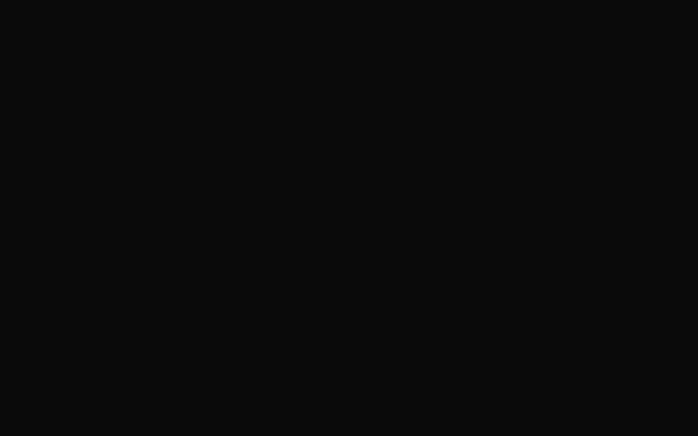
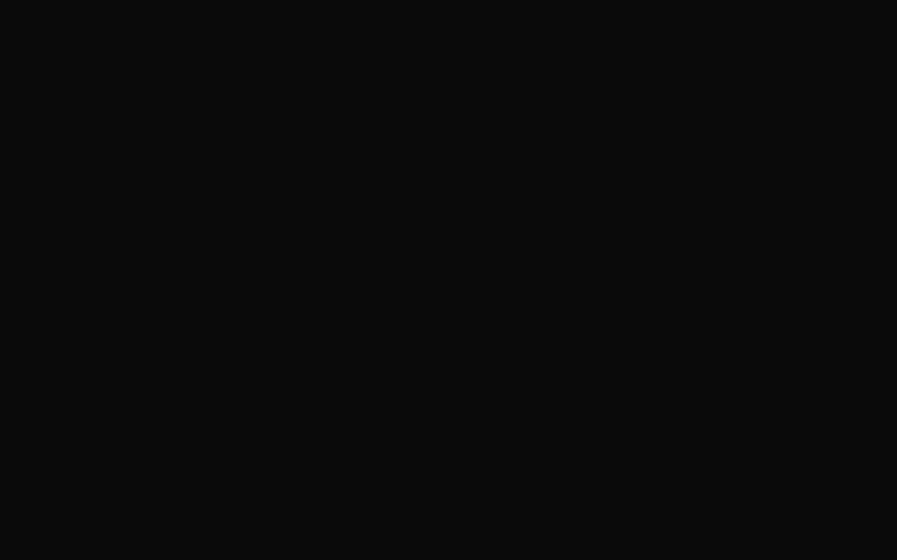
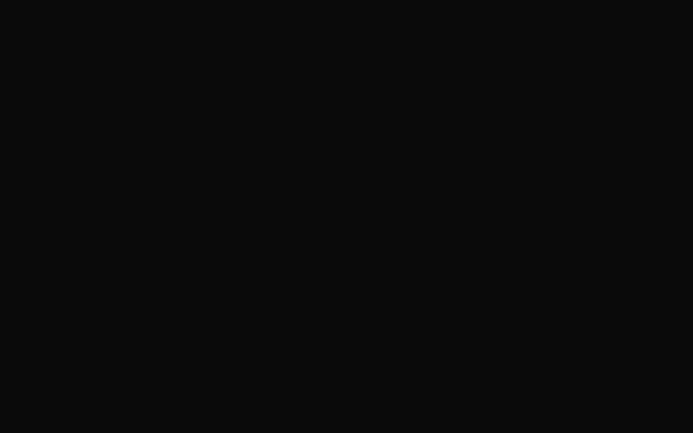

# QKD Playground

[](https://github.com/taoq-ai/qkd-playground/actions/workflows/ci.yml)
[](https://pypi.org/project/qkd-playground/)
[](https://www.npmjs.com/package/@taoq-ai/qkd-playground)
[](https://taoq-ai.github.io/qkd-playground)
[](LICENSE)

Interactive web-based **Quantum Key Distribution** simulator and learning platform.
Step through the BB84 protocol, visualize qubit states, and simulate eavesdropping attacks — all powered by real quantum simulation with [Qiskit](https://qiskit.org/).

## What is QKD?

Quantum Key Distribution uses the laws of quantum mechanics to establish a shared secret key between two parties (Alice and Bob). Any attempt by an eavesdropper (Eve) to intercept the quantum states introduces detectable errors, making QKD theoretically unbreakable.

## Screenshots

### Configure your simulation
Choose the number of qubits and optionally enable an eavesdropper (Eve).



### Step through the BB84 protocol
Watch Alice prepare qubits, Bob measure them, and see basis comparison in real-time.



### Detect eavesdropping
When Eve intercepts qubits, the error rate jumps above the 11% threshold — the protocol detects the intrusion and discards the key.



## Quick Start

### Backend

```bash
cd backend
uv sync
uv run uvicorn qkd_playground.api.app:create_app --factory --reload --port 8000
```

### Frontend

```bash
cd frontend
yarn install
yarn dev    # starts at http://localhost:5173, proxies API to :8000
```

### Run both together

```bash
# Terminal 1 — Backend
cd backend && uv run uvicorn qkd_playground.api.app:create_app --factory --reload

# Terminal 2 — Frontend
cd frontend && yarn dev
```

Then open [http://localhost:5173](http://localhost:5173).

### Documentation

```bash
pip install mkdocs-material
mkdocs serve    # local docs at http://127.0.0.1:8000
```

## Architecture

This project uses **hexagonal architecture** (ports & adapters) in both backend and frontend:

```
backend/src/qkd_playground/
  domain/        # Core models + port interfaces (framework-agnostic)
  adapters/      # Qiskit measurement, BB84 protocol, channels
  api/           # FastAPI driving adapter

frontend/src/
  domain/        # TypeScript types mirroring backend models
  adapters/      # API client adapter
  ui/            # React components
```

### Key Design Decisions

- **Domain logic is framework-agnostic** — no FastAPI/React imports in `domain/`
- **Ports are abstract base classes** (Python) / **interfaces** (TypeScript)
- **Real quantum simulation** — uses Qiskit `StatevectorSampler`, not mock randomness
- **Step-by-step execution** — protocol advances one phase at a time for educational visualization

## API Endpoints

| Method | Path | Description |
|--------|------|-------------|
| `POST` | `/simulation/create` | Create simulation (protocol, qubits, eavesdropper) |
| `POST` | `/simulation/{id}/step` | Advance one protocol phase |
| `POST` | `/simulation/{id}/run` | Run to completion |
| `GET` | `/simulation/{id}/state` | Get full simulation state |
| `POST` | `/simulation/{id}/reset` | Reset for re-run |
| `GET` | `/protocols` | List available protocols |
| `GET` | `/health` | Health check |

## BB84 Protocol Phases

1. **Preparation** — Alice chooses random bits and encodes each in a random basis (rectilinear + or diagonal ×)
2. **Transmission** — Qubits travel through the quantum channel (Eve may intercept)
3. **Measurement** — Bob measures each qubit in a randomly chosen basis
4. **Sifting** — Alice and Bob compare bases over a classical channel, keeping only matching positions (~50%)
5. **Error Estimation** — Sample the sifted key to estimate error rate; >11% suggests eavesdropping

## Tech Stack

| Layer | Technology |
|-------|-----------|
| Backend | Python 3.11+, FastAPI, Qiskit, Pydantic |
| Frontend | TypeScript, React 19, Vite |
| Testing | pytest (25 tests), vitest |
| Docs | MkDocs Material |
| CI/CD | GitHub Actions → PyPI + npm |

## Testing

```bash
# Backend — 25 tests (BB84 engine + API integration)
cd backend && uv run pytest -v

# Frontend — type and lint checks
cd frontend && yarn typecheck && yarn lint && yarn test
```

## Contributing

1. Fork the repository
2. Create a feature branch (`git checkout -b feat/my-feature`)
3. Make your changes with tests
4. Run `uv run ruff check .` and `yarn lint` to ensure code quality
5. Open a Pull Request

## Roadmap

- [x] BB84 protocol engine with Qiskit simulation
- [x] FastAPI backend with step-through API
- [x] React UI with TaoQ AI branding
- [x] Eavesdropper (Eve) simulation
- [x] CI/CD pipeline (GitHub Actions → PyPI + npm)
- [x] MkDocs documentation
- [ ] E91 (Ekert) protocol
- [ ] B92 protocol
- [ ] Interactive circuit visualizer
- [ ] Statistics and graphs (QBER, key rates)
- [ ] Educational concept panels

## License

[Apache License 2.0](LICENSE)

---

Built by [TaoQ AI](https://taoq.ai) · Powered by [Qiskit](https://qiskit.org/)
