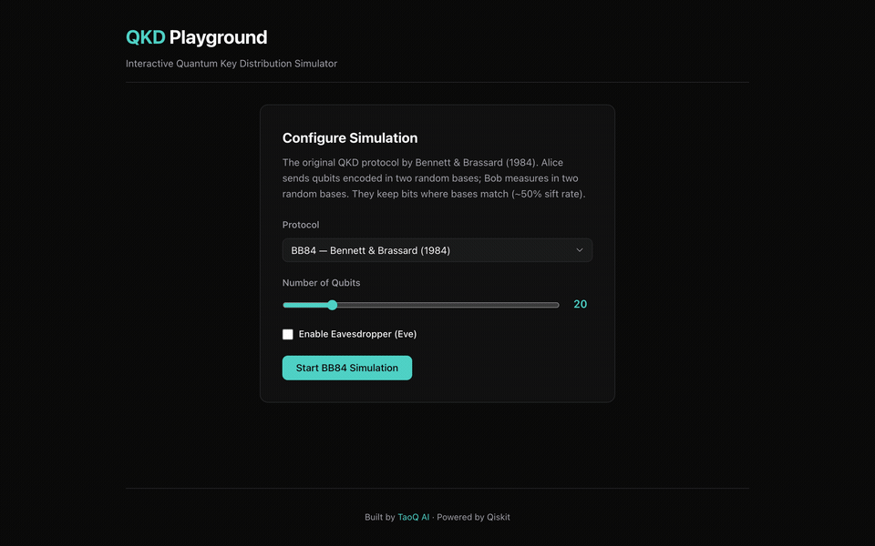

# QKD Playground

[](https://github.com/taoq-ai/qkd-playground/actions/workflows/ci.yml)
[](https://pypi.org/project/qkd-playground/)
[](https://www.npmjs.com/package/@taoq-ai/qkd-playground)
[](https://taoq-ai.github.io/qkd-playground)
[](LICENSE)
Interactive web-based **Quantum Key Distribution** simulator and learning platform.
Step through **BB84**, **B92**, **E91**, and **SARG04** protocols, visualize qubit states with an interactive circuit diagram, explore quantum concepts, and simulate eavesdropping attacks — all powered by real quantum simulation with [Qiskit](https://qiskit.org/).



## What is QKD?

Quantum Key Distribution uses the laws of quantum mechanics to establish a shared secret key between two parties (Alice and Bob). Any attempt by an eavesdropper (Eve) to intercept the quantum states introduces detectable errors, making QKD theoretically unbreakable.

## Features

- **Four QKD protocols** — BB84, B92, E91, and SARG04 (PNS-attack resistant)
- **Interactive circuit visualizer** — SVG-based quantum circuit diagram that updates with each protocol phase
- **Eavesdropper simulation** — Enable Eve to intercept qubits and see how error rates reveal her presence
- **Channel noise models** — Configurable depolarizing noise and photon loss to simulate real-world quantum channels
- **Information reconciliation** — Cascade-inspired error correction that fixes discrepancies between Alice and Bob's keys
- **Privacy amplification** — Hash-based key compression that eliminates any information an eavesdropper may have gained
- **Concept explanation panels** — Learn about qubits, superposition, no-cloning, Bell inequalities, and more as you step through
- **Statistics dashboard** — QBER gauge, key efficiency chart, and sift rate metrics
- **Real quantum simulation** — Powered by Qiskit's `StatevectorSampler`, not mock randomness
- **Docker support** — One-command deployment with Docker Compose
- **Hugging Face Spaces** — One-click cloud deployment with Hugging Face Spaces

## Screenshots

### Configure your simulation

Choose the protocol, number of qubits, and optionally enable an eavesdropper (Eve).


### Step through the protocol

Watch Alice prepare qubits, Bob measure them, and see basis comparison in real-time.


### Detect eavesdropping

When Eve intercepts qubits, the error rate jumps above the threshold — the protocol detects the intrusion and discards the key.


## Quick Start

### Install from PyPI

```bash
pip install qkd-playground
qkd-playground              # opens at http://localhost:8000
qkd-playground --port 3000  # custom port
```

The Python package includes the bundled frontend — no Node.js required.

### Docker

```bash
docker-compose up --build
# App available at http://localhost:8000
```

### Deploy to Hugging Face Spaces

1. Create a new Space at [huggingface.co/new-space](https://huggingface.co/new-space)
2. Select **Docker** as the Space SDK
3. Connect your GitHub repository or push directly
4. The Space will build and deploy automatically

The app will be available at `https://huggingface.co/spaces/<your-username>/qkd-playground`

### Development Setup

```bash
# Terminal 1 — Backend
cd backend && uv sync && uv run uvicorn qkd_playground.api.app:create_app --factory --reload

# Terminal 2 — Frontend
cd frontend && yarn install && yarn dev
```

Then open [http://localhost:5173](http://localhost:5173).

### Documentation

```bash
pip install mkdocs-material
mkdocs serve    # local docs at http://127.0.0.1:8000
```

## Architecture

This project uses **hexagonal architecture** (ports & adapters) in both backend and frontend:

```
backend/src/qkd_playground/
  domain/        # Core models + port interfaces (framework-agnostic)
  adapters/      # Protocol engines (BB84, B92, E91, SARG04), Qiskit simulation,
                 #   channel noise models, post-processing (reconciliation + amplification)
  api/           # FastAPI driving adapter

frontend/src/
  domain/        # TypeScript types, concept data, statistics computation
  adapters/      # API client adapter
  ui/            # React components (CircuitDiagram, ConceptPanel, StatisticsPanel, etc.)
```

### Key Design Decisions

- **Domain logic is framework-agnostic** — no FastAPI/React imports in `domain/`
- **Ports are abstract base classes** (Python) / **interfaces** (TypeScript)
- **Real quantum simulation** — uses Qiskit `StatevectorSampler`, not mock randomness
- **Step-by-step execution** — protocol advances one phase at a time for educational visualization

## API Endpoints

| Method | Path | Description |
|--------|------|-------------|
| `POST` | `/simulation/create` | Create simulation (protocol, qubits, eavesdropper, noise) |
| `POST` | `/simulation/{id}/step` | Advance one protocol phase |
| `POST` | `/simulation/{id}/run` | Run to completion |
| `GET` | `/simulation/{id}/state` | Get full simulation state |
| `POST` | `/simulation/{id}/reset` | Reset for re-run |
| `GET` | `/protocols` | List available protocols |
| `GET` | `/health` | Health check |

## Supported Protocols

### BB84 (Bennett & Brassard 1984)

1. **Preparation** — Alice chooses random bits and encodes each in a random basis (rectilinear + or diagonal ×)
2. **Transmission** — Qubits travel through the quantum channel (Eve may intercept)
3. **Measurement** — Bob measures each qubit in a randomly chosen basis
4. **Sifting** — Alice and Bob compare bases over a classical channel, keeping only matching positions (~50%)
5. **Error Estimation** — Sample the sifted key to estimate error rate; >11% suggests eavesdropping
6. **Reconciliation** — Cascade-inspired error correction to fix remaining discrepancies
7. **Privacy Amplification** — Hash-based key compression to eliminate leaked information

### B92 (Bennett 1992)

Uses only two non-orthogonal states (|0⟩ and |+⟩). Bob's inconclusive measurements are discarded, yielding a lower but more robust key rate (~25% sift rate).

### E91 (Ekert 1991)

Uses entangled Bell pairs. Alice and Bob perform measurements on their respective qubits. The CHSH inequality test detects eavesdropping without direct basis comparison.

### SARG04 (Scarani et al. 2004)

A BB84 variant designed to resist **photon number splitting (PNS) attacks**. Instead of announcing bases during sifting, Alice announces non-orthogonal state pairs. This makes it harder for Eve to exploit multi-photon pulses, at the cost of a lower sift rate (~25% vs BB84's ~50%).

## Tech Stack

| Layer | Technology |
|-------|-----------|
| Backend | Python 3.11+, FastAPI, Qiskit, Pydantic |
| Frontend | TypeScript, React 19, Vite, Recharts |
| Testing | pytest (80 tests), vitest |
| Docs | MkDocs Material |
| CI/CD | GitHub Actions, Docker, Hugging Face Spaces |

## Testing

```bash
# Backend — 80 tests (BB84/B92/E91/SARG04 engines, channel noise, post-processing, API)
cd backend && uv run pytest -v

# Frontend — type and lint checks
cd frontend && yarn typecheck && yarn lint && yarn test
```

## Recording the Demo GIF

The demo GIF is generated with a Playwright script:

```bash
npx playwright install chromium   # first time only
bash scripts/record-demo.sh       # starts servers, records, creates GIF
```

## Contributing

1. Fork the repository
2. Create a feature branch (`git checkout -b feat/my-feature`)
3. Make your changes with tests
4. Run `uv run ruff check .` and `yarn lint` to ensure code quality
5. Open a Pull Request

## Roadmap

- [x] BB84 protocol engine with Qiskit simulation
- [x] FastAPI backend with step-through API
- [x] React UI with TaoQ AI branding
- [x] Eavesdropper (Eve) simulation
- [x] CI/CD pipeline (GitHub Actions → PyPI + npm)
- [x] MkDocs documentation
- [x] E91 (Ekert) protocol
- [x] B92 protocol
- [x] Interactive circuit visualizer
- [x] Eve comparison view with interception data
- [x] Statistics and graphs (QBER gauge, key efficiency)
- [x] Educational concept panels
- [x] SARG04 protocol (PNS-attack resistant)
- [x] Channel noise models (depolarizing + photon loss)
- [x] Information reconciliation (Cascade-inspired)
- [x] Privacy amplification (hash-based)
- [x] Docker support
- [x] Hugging Face Spaces deployment

## License

[Apache License 2.0](LICENSE)

---

Built by [TaoQ AI](https://taoq.ai) · Powered by [Qiskit](https://qiskit.org/)
