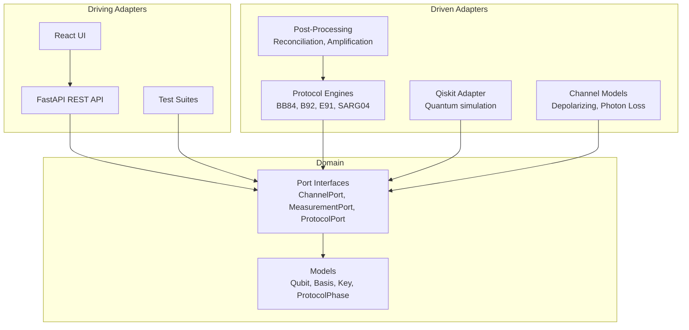

# Architecture

QKD Playground uses **hexagonal architecture** (ports & adapters) to keep core quantum simulation logic independent of frameworks and infrastructure.

## Overview



## Key Principles

1. **Domain is framework-agnostic** — No FastAPI or React imports in `domain/`
2. **Ports define contracts** — Abstract base classes (Python) or interfaces (TypeScript)
3. **Adapters are swappable** — Qiskit today, different simulator tomorrow
4. **Dependencies point inward** — Adapters depend on domain, never the reverse

## Deployment Model

The frontend SPA is bundled into the Python wheel at build time via a custom hatch build hook (`hatch_build.py`). FastAPI serves the static assets alongside the API, so users get a single-command install:

```bash
pip install qkd-playground
qkd-playground
```

Alternatively, deploy with Docker:

```bash
docker-compose up --build
```

The npm package (`@taoq-ai/qkd-playground`) remains available for consumers who want to embed the React components in their own applications.

## Backend Structure

```
backend/src/qkd_playground/
├── domain/
│   ├── models.py           # Qubit, Basis, BitValue, ProtocolPhase, ProtocolResult
│   └── ports.py            # QuantumChannelPort, MeasurementPort, ProtocolPort
├── adapters/
│   ├── bb84.py             # BB84 protocol engine
│   ├── b92.py              # B92 protocol engine
│   ├── e91.py              # E91 protocol engine
│   ├── sarg04.py           # SARG04 protocol engine (PNS-resistant)
│   ├── qiskit_adapter.py   # Qiskit simulation + NoisyChannel + CompositeChannel
│   └── post_processing.py  # Information reconciliation + privacy amplification
├── api/
│   └── app.py              # FastAPI application factory (serves API + bundled frontend)
├── cli.py                  # CLI entry point (qkd-playground command)
└── static/                 # Bundled frontend SPA (auto-generated at build time)
```

### Domain Models

- **`Qubit`** — A qubit prepared in a specific basis with a bit value
- **`Basis`** — Rectilinear (Z) or Diagonal (X) measurement basis
- **`BitValue`** — Classical bit: 0 or 1
- **`ProtocolPhase`** — Protocol execution phases: preparation → transmission → measurement → sifting → error estimation → reconciliation → privacy amplification → complete
- **`ProtocolResult`** — Shared key, error rate, detection flags, amplified key

### Port Interfaces

- **`QuantumChannelPort`** — Transmit qubits (may add noise/eavesdropping)
- **`MeasurementPort`** — Prepare and measure qubits
- **`ProtocolPort`** — Run full QKD protocol end-to-end or step-by-step
- **`RandomnessPort`** — Generate random basis and bit choices

## Frontend Structure

```
frontend/src/
├── domain/       # TypeScript interfaces, concept data, statistics computation
├── adapters/     # API client implementing SimulationPort
└── ui/           # React components (CircuitDiagram, ConceptPanel, StatisticsPanel, etc.)
```

The frontend follows the same hexagonal pattern: UI components depend only on domain types, and adapters handle API communication.
